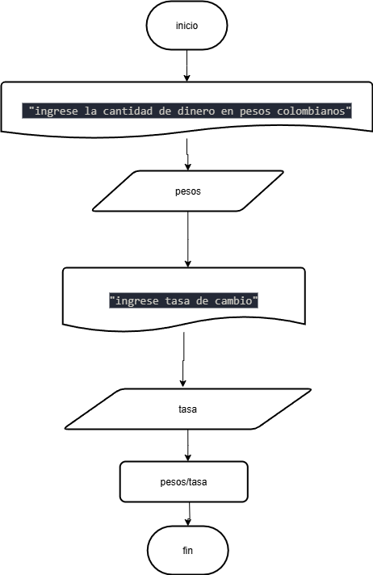

# una empresa importadora desea determinar cuantos dolares puede adquirir con equis cantidad de dinero colombiano. Realice un diagrama de flujo y pseudocodigo que represente el algoritmo para tal fin.

## pseudocódigo

```
inicio  
escribir "ingrese la cantidad de dinero en pesos colombianos"
leer pesos 
escribir "ingrese tasa de cambio"
leer tasa
dolares = pesos / tasa
Fin

```

## Diagrama de flujo
   
