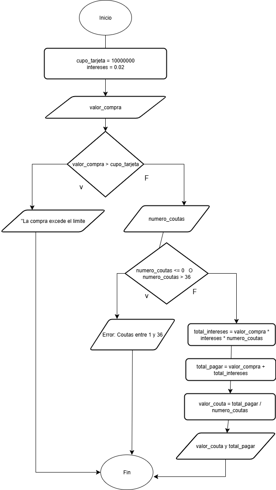

# Tarea #2:
Tienen una tarjeta de $10.000.000. Calcular el valor de todas las cuotas sabiendo:
1. Valor de la compra
2. Tasa de interés del 2%
3. Número de cuotas. Máximo 36. 

## Pseudocodigo

```  
inicio  
       cupo_tarjetas = 10000000
    interes = 0.02
 
    Leer valor_compra
    Si valor_compra > cupo_tarjeta Entonces
        MOSTRAR "Error: Fondos insuficientes"
        Fin
    Fin si
 
    Leer numero_cuotas
    Si numero_cuotas <= 0 O numero_cuotas > 36 ENTONCES
        MOSTRAR "Error: El número de cuotas debe ser entre 1 y 36"
        Fin
    Fin si
 
    total_interes = valor_compra * interes * numero_cuotas
    total_pagar = valor_compra + total_interes
    valor_cuota = total_pagar / numero_cuotas
 
    Mostrar "Valor de cada cuota: ", valor_cuota
    Mostrar "Total a pagar: ", total_pagar
fin  
```    

## Diagrama:

   
